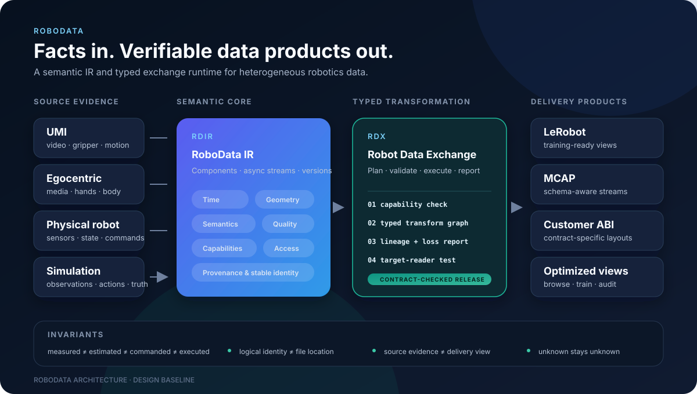

# RoboData

**Open data infrastructure for robotics.**

RoboData defines a semantic intermediate representation for asynchronous,
multimodal robotics data and a typed transformation model for turning captured
facts into reproducible training and delivery products.

  

RoboData is the project and SDK namespace. **RoboData IR (RDIR)** is the
canonical semantic model. **RDX (Robot Data Exchange)** is the transformation,
validation, and delivery runtime.

For the full data lifecycle, who touches which stage, and how a delivered
sample traces back to evidence, see the
[visual guide](docs/visual-guide.md).

## Why RoboData

Robotics datasets often collapse asynchronous streams into an episode table,
erase the distinction between measured and estimated values, and encode action
semantics in tribal knowledge. That makes conversion easy to start and hard to
trust.

RoboData keeps the source facts intact and makes interpretation explicit:

- time domains, synchronization, and validity intervals are first-class;
- frames, units, embodiment, and action representations are typed;
- measured, commanded, estimated, retargeted, and simulated values stay distinct;
- transformations declare preconditions, loss, versions, and lineage;
- delivery contracts are machine-readable and testable with the target reader;
- logical semantics are independent of files, shards, codecs, and storage engines.

## Scope

The first milestone targets four source families—UMI, egocentric capture,
physical robots, and simulation—and three delivery paths: LeRobot, schema-aware
MCAP, and one real customer format.

This repository is currently in the **design and specification phase**. No data
format or API should be treated as stable yet.

## Start here

- [Architecture](docs/architecture.md)
- [Deep research synthesis](docs/research/deep-research.md)
- [Visual guide: the life of robotics data](docs/visual-guide.md)
- [Industry landscape 2026](docs/research/industry-landscape-2026.md)
- [Perspectives: supplier and training consumer](docs/perspectives/README.md)
- [Initial roadmap](docs/roadmap.md)
- [Naming decision](docs/decisions/0001-project-naming.md)
- [IR and contract decision](docs/decisions/0002-semantic-ir-and-contracts.md)
- [Example delivery contract](examples/contracts/umi-to-lerobot.yaml)
- [Contributing](CONTRIBUTING.md)

## Design north star

> Unify facts, time, physical semantics, and provenance. Treat sampling rates,
> action representations, and file layouts as versioned, verifiable products of
> those facts.

## License

RoboData is licensed under the [MIT License](LICENSE).
