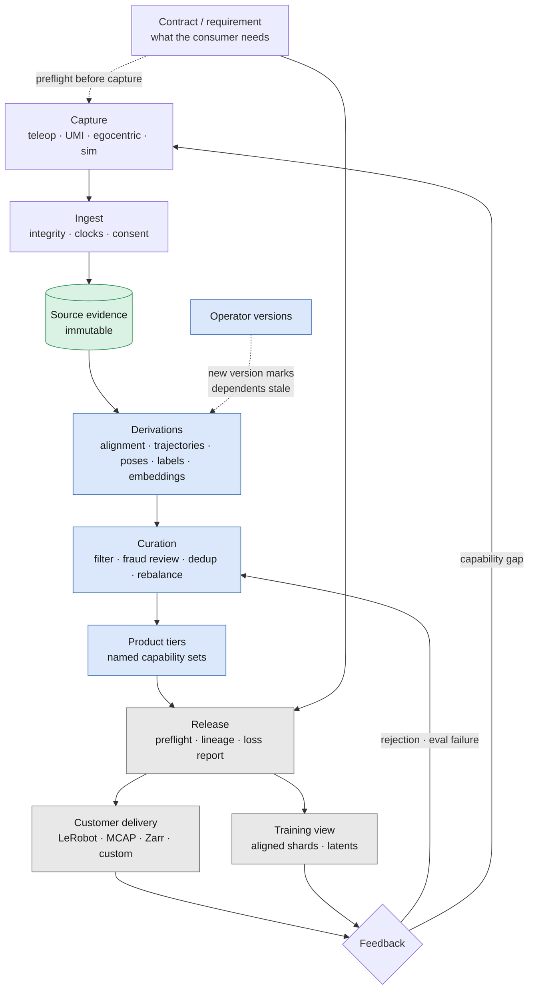
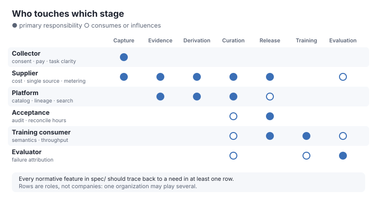
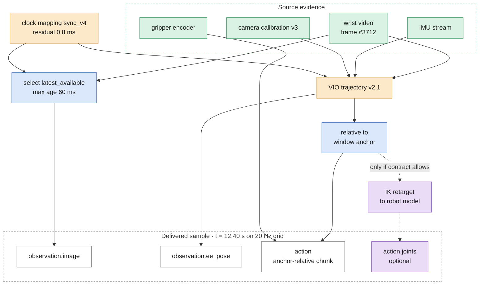
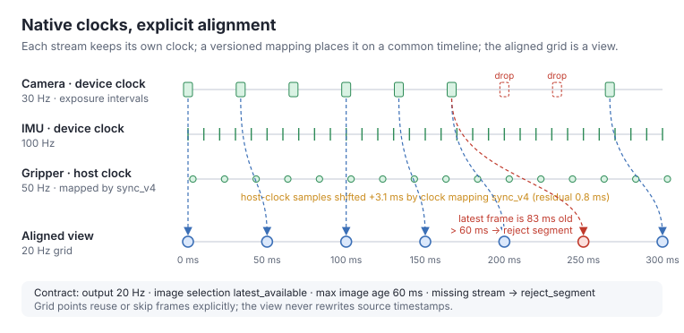
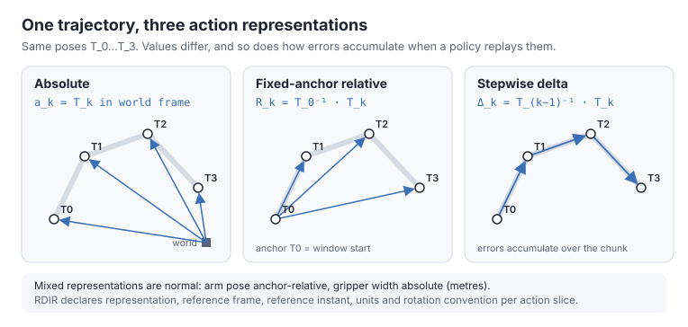
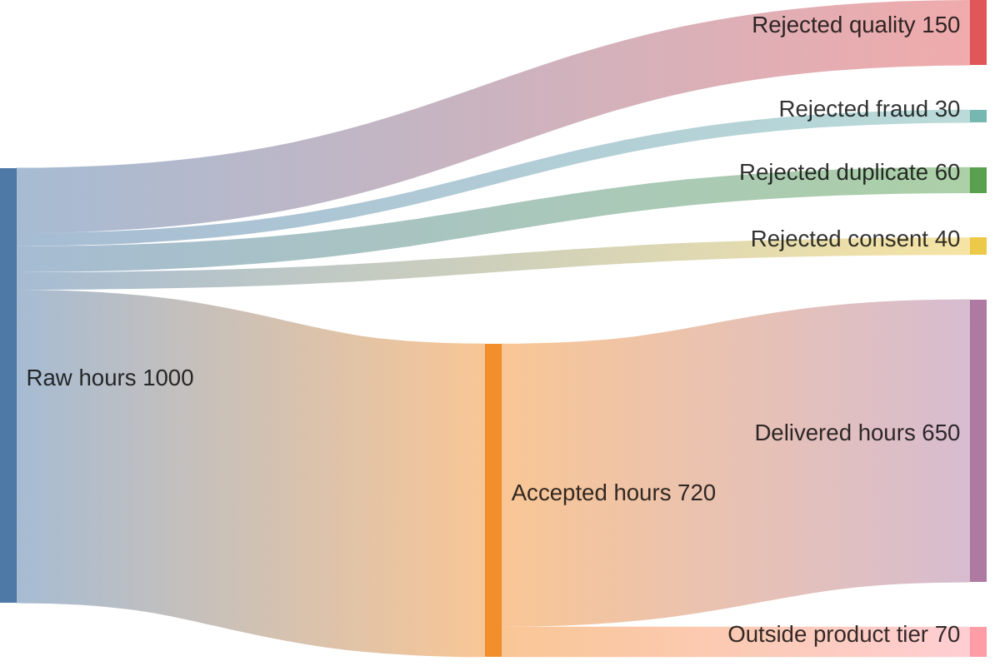
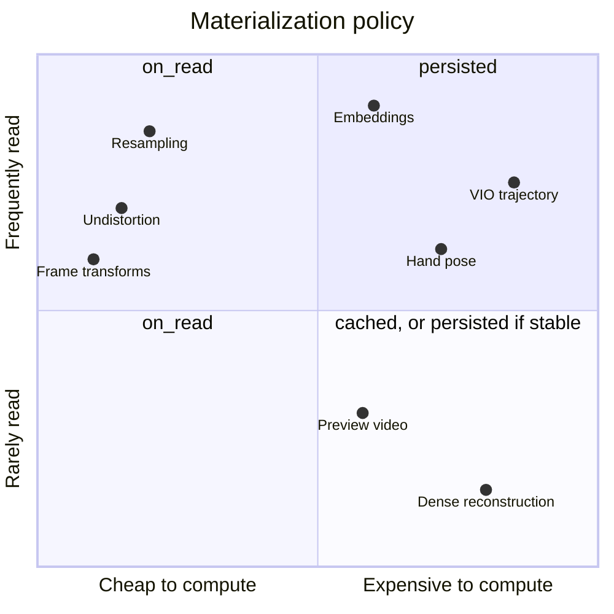
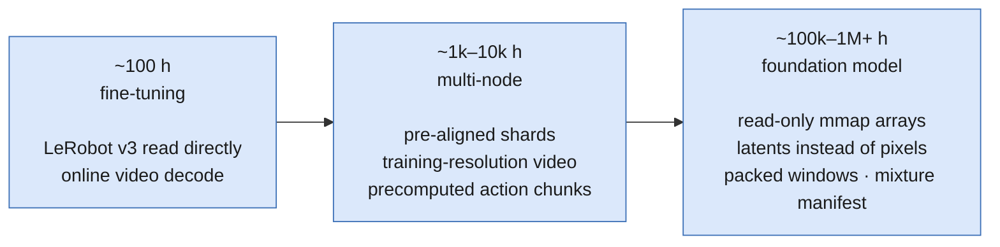

# Visual guide: the life of robotics data

> Status: informative. These diagrams are discussion aids for every
> perspective. They are written as Mermaid or plain SVG so anyone can propose
> changes through a pull request. Numbers in examples are illustrative.

Colour convention used across diagrams:

- **Green**: measured source evidence
- **Amber**: estimated values (reconstruction, pose estimation, clock mapping)
- **Blue**: exact derivations (frame transforms, resampling, action construction)
- **Purple**: retargeted or simulated values
- **Grey**: packaging and delivery

## 1. Lifecycle

Data is captured once, preserved as evidence, and turned into many products.
Feedback from customers and evaluation flows back into curation or new capture.

## 2. Who touches which stage

Each perspective enters the lifecycle at different points and cares about
different things. See [perspectives](perspectives/README.md).

## 3. Lineage of one training sample

Every value in a delivered sample should be explainable back to evidence, with
its epistemic role visible. Optional retargeted joints appear only when the
contract allows them.

## 4. Time: native clocks, explicit alignment

Streams keep their own clocks. Alignment is a versioned mapping; the aligned
grid is a view with a declared selection policy and a declared failure mode.

## 5. Action representations

The same trajectory can be encoded in three different ways. A single
`relative: true` flag cannot tell them apart.

## 6. What is an hour? Metering from capture to delivery

Illustrative numbers. Delivering the same episodes as both LeRobot and MCAP
does not change delivered hours.

## 7. Compute or store?

A derivation's materialization policy depends on compute cost, read frequency,
storage cost, and algorithm stability. Unstable algorithms push expensive
results toward `cached` rather than `persisted`.

## 8. Training data shape by scale

Storage format and training format are different products. Thresholds are
hypotheses to be validated with published benchmarks.

